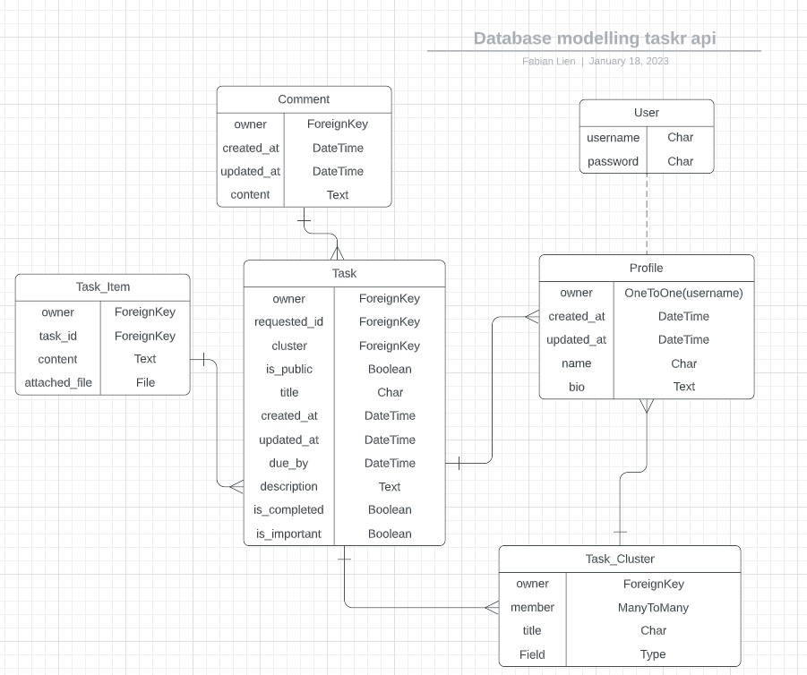

# taskr DRF API - [Live link](https://taskr-api.herokuapp.com/)

## This is a backend REST API for the [taskr React project](https://taskr-react.herokuapp.com/). For more information about taskr, please look to the README found in the  [taskr repository](https://github.com/fabianlien/taskr).

## Data modeling:
Below is a relational database model created at the begining of the project. Since the current scope has been narrowed significantly the number of models and fields present have been altered noticeably.

 

## Manual Testing:

| Test Area  | Action                        | Expected Result                                                       | Pass |
| ---------- | ----------------------------- | --------------------------- | ---------------------------------------------- |
| Users      | Create, read, update, delete  | New users can be created via the frontend using All-auth. Users can be created, read, edited or deleted from the Admin panel.| ✓   |
| Profiles   | Read only                     | A list of all profiles is readable without authentication from the "/profiles" endpoint. | ✓    |
| Profiles   | Create, update, delete        | Profiles can be created, updated or deleted by the owner from the "/profiles/id" endpoint  | ✓    |
| Tasks      | Read only                     | A list of all tasks is readable without authentication from the "/tasks" endpoint.  | ✓    |
| Tasks      | Create, update, delete        | Tasks can created updated or delete by the owner from the "tasks/id" endpoint. | ✓    |
| Task Items | Read only                     | A list of all task items is readable without authentication from the "/taskitems" endpoint.  | ✓    |
| Task Items | Create, update, delete        | Taskitems can created updated or delete by the owner from the "taskitems/id" endpoint. | ✓    |

 

## Deployment:

 

1.  Clone [this repository](https://github.com/fabianlien/taskr-api).
2.  In your IDE, connect to your repo, then enter this command in the terminal:
        
        pip install -r requirements.txt

- Make sure your INSTALLED_APPS in settings.py look like this:

        INSTALLED_APPS = [
        'django.contrib.admin',
        'django.contrib.auth',
        'django.contrib.contenttypes',
        'django.contrib.sessions',
        'django.contrib.messages',
        'cloudinary_storage',
        'django.contrib.staticfiles',
        'cloudinary',
        'rest_framework',
        'rest_framework.authtoken',
        'dj_rest_auth',
        'django.contrib.sites',
        'allauth',
        'allauth.account',
        'allauth.socialaccount',
        'dj_rest_auth.registration',
        'corsheaders',
        'django_filters',
        'profiles',
        'tasks',
        ]

3. In you terminal, enter these commands in the terminal:

        python manage.py makemigrations
        python manage.py migrate

4.  Git add, commit and push all changes to your repo.
5.  Create or log into an account on [Heroku](https://www.heroku.com/home).
6.  Create a new app on Heroku.
7.  Create or log into and account on [ElephantSQL](https://www.elephantsql.com).
8.  Create a new instance from your dashboard.
9.  Go back to your dashboard and copy the database URL from the new instance.
10. In the Settings tab for your Heroku app, create a new Config Var **DATABASE_URL** and paste the database URL from ElephantSQL.
11.  In the Deploy tab on Heroku, go to Deployment method and add your GitHub repository.
12.  In the Deploy tab on Heroku, go to Manual deploy and select deploy branch for early deployment.
13. Create or log in to an account on Cloudinary.
14. Copy your API Environment Variable.
15. Go back to your Heroku app Settings and create a new Config Var **CLOUDINARY_URL** and paste the API environment variable.
16. Add the following variables to your Config Vars:
    - **ALLOWED_HOST** --> *Your deployed API URL*
    - **CLIENT_ORIGIN** --> *Your deployed frontend URL*
    - **SECRET_KEY** --> *Add a secret key of your choice*
    - **DISABLE_COLLECTSTATIC** --> **1**
14. Create an env.py in the root directory, add it to .gitignore and add these lines at the top

        import os

        os.environ['SECRET_KEY'] = "YOUR SECRET KEY"
        os.environ['CLOUDINARY_URL'] = "YOUR CLOUDINARY URL"
        os.environ['DEV'] = '1'
        os.environ['CLIENT_ORIGIN'] = "YOUR FRONT END HEROKU APP URL"
        os.environ.setdefault("DATABASE_URL", "YOUR ELEPHANT SQL DATABASE URL")

15. In settings.py, update the CORS_ALLOWED_ORIGIN_REGEXES variable to match your local server url.

        if 'CLIENT_ORIGIN_DEV' in os.environ:
            extracted_url = re.match(r'^.+-', os.environ.get('CLIENT_ORIGIN_DEV', ''), re.IGNORECASE).group(0)
            CORS_ALLOWED_ORIGIN_REGEXES = [
                rf"{extracted_url}(eu|us)\d+\w\.gitpod\.io$",
            ]

16. Create a superuser for your site:

        python manage.py createsuperuser

17. To run your app locally, enter this command in your terminal:
        python manage.py runserver
    
The project is set up to automatically switch between DEBUG: True and False for the development server and deployed site.

 

## Credits

### The default profile image used in the Profile model was taken from the Code Institute pcourse material.  

### A special thanks to my mentor Antonio Rodriguez for your guidance and all your help throughout the project.